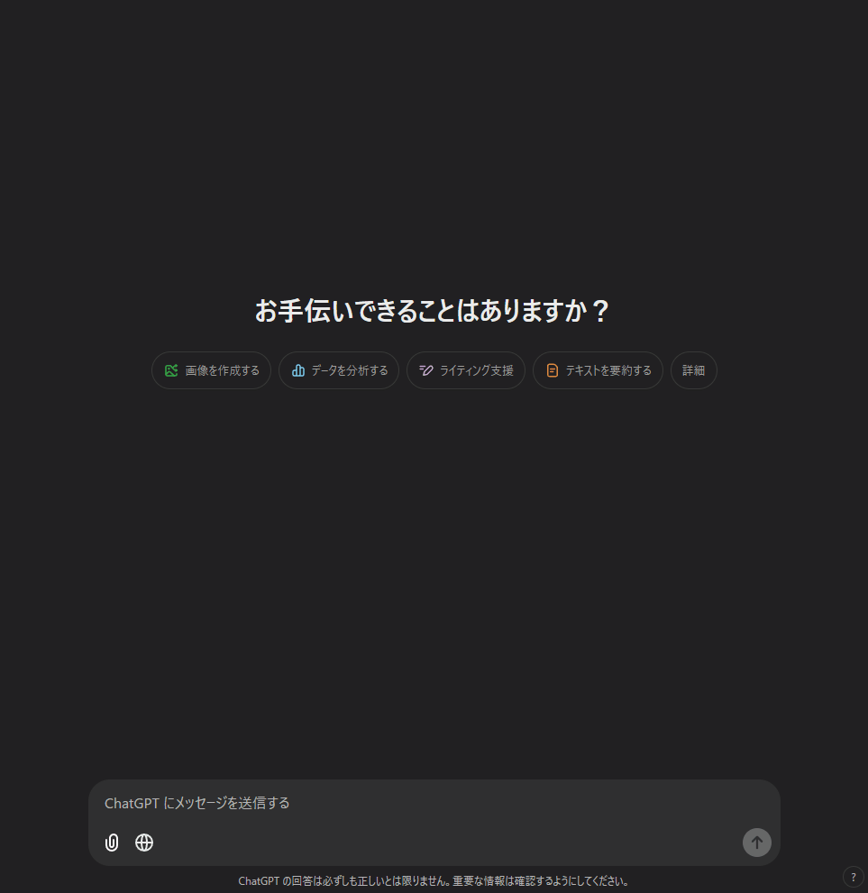

# This is ...
Automate ChatGPT Web.  
You can send chats from the console.  



# Install
1. Install tampermonky (This plugin work on tampermonkey)  
    ref: https://chromewebstore.google.com/detail/tampermonkey/dhdgffkkebhmkfjojejmpbldmpobfkfo
2. Install this plugin  
    ref: [cgpt_automate.user.js](./cgpt_automate.user.js)

# How to use
Functions:
* cgpt.chat
* cgpt.chatBulk
* cgpt.callWhenChatAvailable
* cgpt.isChatAvailable

## chat: Send chat only once
example
```javascript
cgpt.chat("hello");
```

## chatBulk: Send multiple chats at once
example
```javascript
cgpt.chatBulk(["hello","nice to meet you","howdy?"]);
```

## callWhenChatAvailable: Register a callback
Register a callback function to be called when chatting is enabled.  
The function takes chat as an argument.  

example
```javascript
let i = 0;
cgpt.callWhenChatAvailable(chat =>{
    chat(`hello ${i} times`);
    i++;
});
```

## isChatAvailable: Check is chat available
```javascript
console.log(cgpt.isChatAvailable());
```